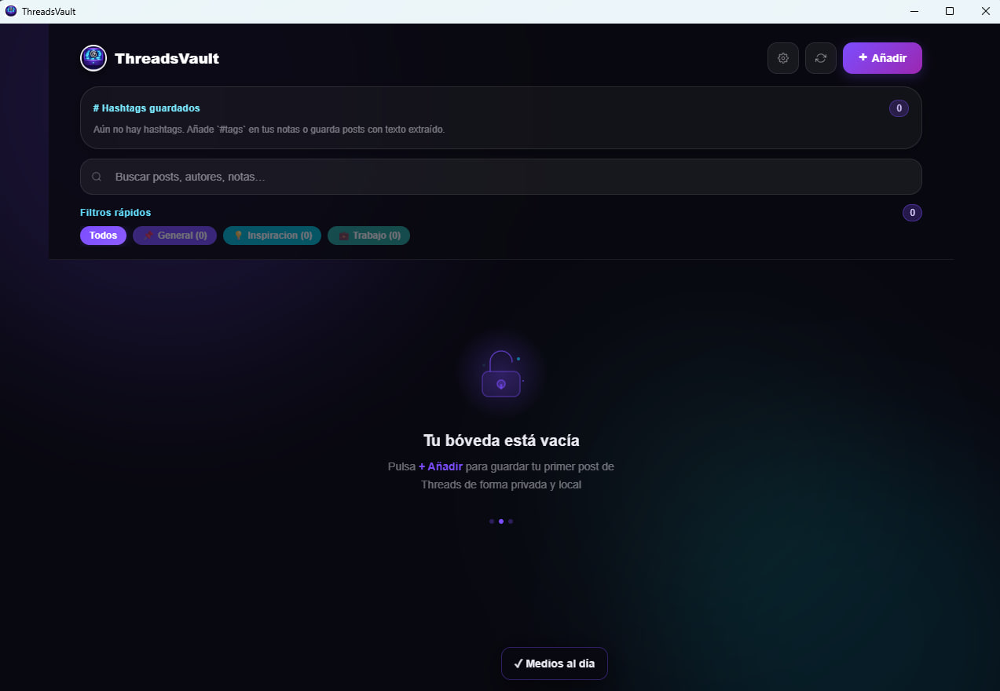
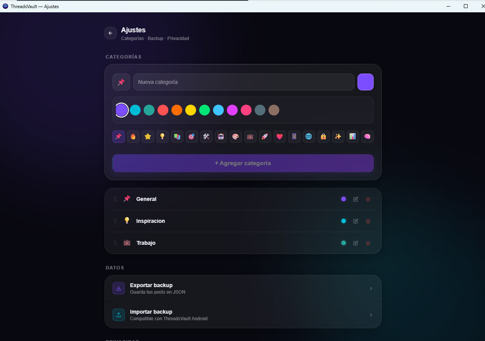
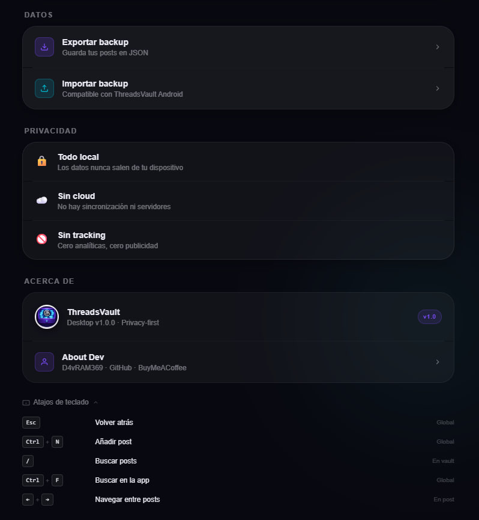

# ThreadsVault Desktop


<!-- badges -->


[](https://www.anthropic.com/claude-code)
[](https://openai.com/)
[](https://deepwiki.com/D4vRAM369/ThreadsVault-desktop)

<p align="left">
  <a href="./README_english-version.md">Read in english</a>
</p>


> Una bóveda local para tus posts de Threads. Sin nube. Sin rastreo. Sin cuenta necesaria.

ThreadsVault Desktop es la versión de escritorio de [ThreadsVault para Android](https://github.com/D4vRAM369/ThreadsVault). Su funcionamiento es sencillo: pega la URL de un post de Threads, ésta se extrae, se guarda localmente, y es tuyo. Cierra la app y ábrela en el tiempo que quiera: el texto y las imágenes de tus posts guardados van a seguir ahí (el programa los guarda localmente en segundo plano tras cada guardado).

Puedes clasificar los posts en distintas categorías, el programa indexa los hashtags de las publicaciones y tú puedes usarlos en notas personales al guardar un post, para una mayor facilidad de búsqueda en tu pequeña bóveda personal de hilos que te resulten interesantes o relevantes para guardarlos de forma local, sin depender únicamente del sencillo Guardados de Threads 🗄🧵

---

## Capturas

<table align="center">
  <tr>
    <td align="center" width="33%">
      <br/>
      <b>Bóveda vacía</b><br/>
      <sub>Pantalla principal al primer arranque</sub>
    </td>
    <td align="center" width="33%">
      <br/>
      <b>Categorías</b><br/>
      <sub>Crea y organiza con color e icono</sub>
    </td>
    <td align="center" width="33%">
      <br/>
      <b>Privacidad y ajustes</b><br/>
      <sub>Backup, privacidad, atajos de teclado</sub>
    </td>
  </tr>
    <tr>
    <td align="center" width="33%">
      <br/>
      <b>Bóveda con posts (nuevo modo claro en v2.1)</b><br/>
      <sub>Pantalla principal con modo claro y posts guardados</sub>
    </td>
    <td align="center" width="33%">
      <br/>
      <b>Categorías</b><br/>
      <sub>Vista de categorías en modo claro</sub>
    </td>
    <td align="center" width="33%">
      <br/>
      <b>Privacidad y ajustes</b><br/>
      <sub>Backup, privacidad, atajos de teclado</sub>
    </td>
  </tr>
</table>

---

## Características principales

- **Guardar posts por URL** — pega un enlace de Threads y pulsa guardar. Título, autor, texto e imágenes se extraen automáticamente.
- **Almacenamiento local** — SQLite en escritorio (vía Tauri), IndexedDB en navegador. Nada sale de tu dispositivo.
- **Categorías** — organiza tus posts en categorías personalizadas. Los no categorizados van a una bandeja por defecto.
- **Backup y restauración** — exporta toda tu bóveda como JSON e impórtala cuando quieras. Al importar, la app muestra el progreso y confirma cuántos posts y categorías se restauraron. Los backups de ThreadsVault para Android se pueden importar aquí sin problemas *(Android → Desktop ✅)*. La dirección inversa *(Desktop → Android)* no está soportada aún y se resolverá en una versión futura.
- **Caché de medios** —  las imágenes y vídeos se almacenan localmente para que los posts sobrevivan la expiración de los enlaces CDN. Las imágenes se guardan como data URLs; los vídeos se descargan y quedan disponibles offline.
- **Reproductor integrado** —  reproduce los vídeos guardados en tu bóveda directamente desde la app, con posibilidad de descarga. Integrado en la versión 2.0 mediante yt-dlp y ffmpeg.
- **Notas personales** — añade, edita o elimina notas en cualquier post guardado directamente desde su pantalla de detalle.
- **Atajos de teclado** — navega y busca sin ratón: `Esc` volver, `Ctrl+N` añadir, `/` o `Ctrl+F` buscar, `←` `→` navegar entre posts. `Ctrl+` y `Ctrl-` para zoom-in y zoom-out respectivamente, y `Ctrl+0` regresa al zoom por defecto (la preferencia del zoom se queda guardada de forma persistente tras cerrar el programa).
- **Sin telemetría** — sin analíticas, sin informes de errores, sin peticiones externas más allá de la extracción del post. Todo funciona 100% en local (client-side): ni el desarrollador tiene acceso a tus datos.

---

## Instalación

### Windows

Descarga el instalador `.exe` desde [Releases](../../releases) y ejecútalo.
Se instala en `%LocalAppData%\threadsvault-desktop` y crea un acceso directo en el Menú Inicio.

### Linux

Dos opciones disponibles en [Releases](../../releases):

| Formato | Cómo usarlo |
|---|---|
| `.AppImage` | `chmod +x ThreadsVault_*.AppImage && ./ThreadsVault_*.AppImage` |
| `.deb` | `sudo dpkg -i threadsvault-desktop_*.deb` |


> *Nota: Si el AppImage no arranca en Ubuntu 22.04+, ejecuta `sudo apt install libfuse2`.*


Flatpak planificado para futuras versiones.

---

## Cómo funciona

1. Copia la URL de un post de Threads (ej. `https://www.threads.net/@usuario/post/abc123`)
2. Abre la app → pulsa el botón **+Añadir** en la esquina superior derecha.
3. Pega la URL y pulsa **Guardar**, y añade notas adicionales de forma opcional.
4. La app usa Jina Reader para extraer el contenido — un servicio que actúa como navegador real para poder leer posts de Threads, ya que el acceso directo devuelve la página vacía.
5. El post se guarda localmente. Listo.

---

## Privacidad

- Todos los datos se almacenan en una base de datos SQLite local (`%AppData%\threadsvault-desktop` en Windows, `~/.local/share/threadsvault-desktop` en Linux)
- Las únicas peticiones externas van a `r.jina.ai`: al guardar un post explícitamente, y en segundo plano si la app detecta imágenes desactualizadas al cargar
- Sin datos de uso, sin informes de errores, sin telemetría de ningún tipo

---

## Limitaciones conocidas

- **Solo Threads** — diseñado específicamente para posts de Threads; otras URLs pueden no extraerse correctamente
- **La extracción depende de Jina** — si `r.jina.ai` está caído o aplica rate-limit, la extracción falla de forma controlada
- **macOS no soportado** — requiere cuenta Apple Developer ($99/año) para notarización; no planificado para v1.x (probablemente tampoco para una 2.x).

---

## Compilar desde el código fuente

**Requisitos previos:**
- [Node.js](https://nodejs.org/) 20+
- [Rust](https://rustup.rs/) (toolchain stable)
- En Linux: `libwebkit2gtk-4.1-dev`, `libgtk-3-dev`, `librsvg2-dev`, `libayatana-appindicator3-dev`, `patchelf` (`sudo apt install ...`)

```bash
git clone https://github.com/D4vRAM369/threadsvault-desktop
cd threadsvault-desktop
npm install
npm run tauri build
```

El binario compilado estará en `src-tauri/target/release/bundle/`.

Para desarrollo con hot-reload:
```bash
npm run tauri dev
```

O solo en navegador (sin Tauri, usa IndexedDB en lugar de SQLite):
```bash
npm run dev
```

---

## Stack técnico

| Capa | Tecnología |
|---|---|
| Shell | Tauri v2 |
| Frontend | Svelte 5 (runes) + TypeScript |
| Estilos | Tailwind CSS v4 |
| Almacenamiento (escritorio) | SQLite vía `@tauri-apps/plugin-sql` |
| Almacenamiento (navegador) | Dexie (IndexedDB) |
| Extracción de posts | Jina Reader (`r.jina.ai`) |

---

## Método de desarrollo

Construido mediante **PBL (Project-Based Learning)** — y documentado con artefactos de aprendizaje no incluidos en el repositorio para uso personal y sesiones de estudio teóricas con el programa abierto.

Desarrollado principalmente con asistencia de **Claude Code** y en menor medida con **ChatGPT-5.3-Codex**.

---

## Licencia

[GPL-3.0](LICENSE) — igual que[ ThreadsVault para Android](https://github.com/D4vRAM369/ThreadsVault).
